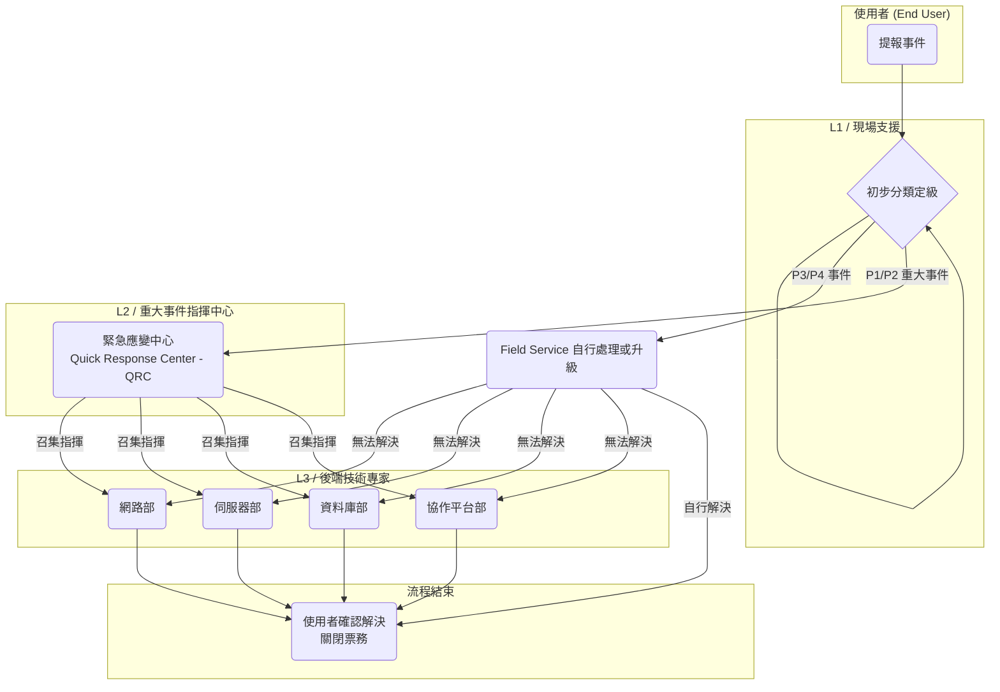

# 0728 內部流程 2.0 版

Category: RAG - 公司組織
Assign: Vincent Hsu

### **2.0 [公司名稱] IT 系統事件票務管理流程 (Incident Ticket Management Process)**

### **1. 目的 (Purpose)**

為建立一套標準化、高效率的 IT 事件回報與處理機制，確保所有 IT 相關事件能被即時記錄、分類、分派、處理及追蹤，從而縮短系統停機時間、降低對公司營運（尤其是產線）的衝擊，並提升 IT 服務品質與使用者滿意度。

### **2. 適用範圍 (Scope)**

本流程適用於公司所有員工，涵蓋所有由 IT 部門維運的資訊系統、軟體、硬體及網路服務。

### **3. 名詞定義 (Definitions)**

- **事件 (Incident):** 任何未預期的 IT 服務中斷或服務品質下降。
- **重大事件 (Major Incident):** 指被定義為 **P1** 或 **P2** 等級的事件，需要緊急應變中心 (QRC) 介入協調。
- **服務等級協議 (SLA):** IT 部門對事件處理的服務水平承諾，包含「回應時間」與「解決時間」。
- **回應時間 (Response Time):** 從使用者提單開始，到 IT 人員接手並開始處理該事件的時間。
- **解決時間 (Resolution Time):** 從事件發生開始，到找到根本原因並恢復服務的時間。

### **4. 權責單位 (Responsible Teams)**

- **緊急應變中心 (Quick Response Center - QRC):**
    - 由 **Sophia Miller** 總監領導。
    - **核心職責：** 擔任所有 **P1/P2 重大事件**的總指揮官。不直接執行修復，但負責 24/7 監控、召集並協調各技術團隊、管理事件通報，並主導事後的根本原因分析 (RCA)。
- **全球終端服務部 (Global Field Service):**
    - 由 **Carlos Rossi** 總監領導。
    - **核心職責：** 擔任 IT 的**單一入口 (Single Point of Contact)**。負責接收**所有**使用者的票務，作為 L1 支援。直接處理所有 P3/P4 事件，並在需要時提供現場支援 (On-site Support)。當鑑別出 P1/P2 事件時，**立即上報至 QRC**。
- **後端技術團隊 (Back-end Technical Teams):**
    - **網路部 (Wei Li 總監):** 作為 L3 支援，處理由 Field Service 或 QRC 升級的網路相關事件。
    - **伺服器部 (Alex Johnson 總監):** 作為 L3 支援，處理伺服器、虛擬化、儲存與作業系統相關事件。
    - **資料庫部 (Priya Sharma 總監):** 作為 L3 支援，處理核心系統資料庫的效能、可用性與資料問題。
    - **協作平台部 (Ben Carter 總監):** 作為 L3 支援，處理 M365 平台的後端架構與複雜功能問題。

---

### **5. 事件優先級與服務等級協議 (SLA)**

所有事件由 **全球終端服務部** 進行初步定級。若定級為 P1/P2，**緊急應變中心 (QRC)** 將立即接手指揮。

| 優先級 | 定義與衝擊範圍 | 對應系統/功能範例 | 主要負責單位 (Primary Responsible Unit) | 回應時間 (SLA Response) | 解決時間目標 (SLA Resolution) |
| --- | --- | --- | --- | --- | --- |
| **P1(Critical)** | **重大事件：**造成產線停工、公司核心營運全面中斷。 | • **產線控制系統 (MES/SCADA) 全面停擺**• 企業資源規劃 (ERP) 系統全公司無法使用 | **QRC (指揮) + 各技術團隊 (執行)** | **< 15 分鐘** | **< 4 小時** |
| **P2(High)** | **高衝擊事件：**造成單一部門或多個部門核心業務流程中斷。 | • **單一產線站點的系統故障**• 財會部門的 ERP 模組無法使用• 全公司的 Email 系統收發異常 | **QRC (監控) + 各技術團隊 (主導)** | **< 1 小時** | **< 8 個工作小時** |
| **P3(Medium)** | **一般事件：**影響單一或少數使用者的工作。 | • **個人 Email 客戶端問題**• Office 軟體功能異常• 無法連接部門印表機 | **全球終端服務部 (Field Service)** | **< 4 個工作小時** | **< 3 個工作日** |
| **P4(Low)** | **低衝擊事件：**對使用者造成輕微不便。 | • "How-to" 類型的操作詢問• 系統介面顯示錯誤但不影響功能 | **全球終端服務部 (Field Service)** | **< 8 個工作小時** | **< 5 個工作日** |

---

### **6. 事件處理流程 (Incident Management Workflow)**

1. **事件提報 (Ticket Creation):**
    - 使用者透過 IT 服務入口網站、Email 或緊急專線提報事件。所有提報管道統一彙整至票務系統。
2. **事件受理與分級 (Reception & Triage):**
    - **全球終端服務部 (Field Service)** 的區域團隊（如 John Lin 領導的 APAC 團隊）接收所有新進票務。
    - 服務人員於 **15 分鐘內**聯繫使用者或檢視內容，並根據 SLA 表設定 **優先級 (P1-P4)**。
3. **事件分派與處理 (Assignment & Resolution):**
    - **對於 P3/P4 事件:**
        - 由 **Field Service** 團隊直接處理。
        - 若需後端支援（如 M365 帳號後台問題），Field Service 可將票務升級至對應的 L3 技術團隊（如**協作平台部**）。
        - L3 團隊處理完畢後，將票務指回 Field Service 進行使用者確認。
    - **對於 P1/P2 重大事件:**
        - **Field Service** 人員鑑別出事件後，**必須立即**透過緊急通報機制，將事件**上報至緊急應變中心 (QRC)**。
        - **QRC** 的值班指揮官 (如 Ken Watanabe) 接手事件，成為**事件總指揮官 (Incident Commander)**。
        - QRC 負責開啟作戰會議室 (War Room Conference Call)，並立即召集所需的技術團隊（如**伺服器部**的 Leo Martinez、**資料庫部**的 Carlos Gomez 等）加入處理。
        - 各技術團隊在 QRC 的協調下進行故障排除，並隨時回報進度。Field Service 則轉為負責對終端使用者進行溝通與安撫。
4. **事件解決與關閉 (Resolution & Closure):**
    - 問題解決後，負責的 IT 人員需在票務中詳實記錄解決方案。
    - **Field Service** 聯繫提單使用者，確認服務已恢復正常。
    - 使用者確認後，由 **Field Service** 將票務狀態設為「已解決」，系統將在 3 個工作日後自動關閉。

### **7. 流程圖 (Workflow Diagram)**

# 0729 資安事件簿

Category: RAG - 公司組織
Assign: Vincent Hsu

# 資安事件簿

---

### **資訊安全事件處理紀錄 (技術導向完整 200 筆)**

| 編號 | SLA 等級 | 資安事件內容 (情境: 外部攻擊與刺探 - 技術導向) | 權責單位 |
| --- | --- | --- | --- |
| SEC-INC-202507-111 | P4 | 防火牆日誌顯示，有零星的外部 IP 嘗試連線至一個未開放的 RDP 服務埠 (3389)。 | 網路部 (Network) |
| SEC-INC-202507-112 | P4 | Email 閘道器攔截到一封帶有通用惡意軟體特徵碼的釣魚郵件。 | 協作平台部 (Collaboration) |
| SEC-INC-202507-113 | P4 | WAF 日誌顯示，有外部 IP 嘗試在公司網站搜尋 `wp-admin.php`頁面 (WordPress 後台)。 | 網路部 (Network) |
| SEC-INC-202507-114 | P4 | IDS 偵測到一次來自外部的 ICMP Ping 掃描。 | 網路部 (Network) |
| SEC-INC-202507-115 | P4 | 威脅情資系統告警，一個曾與公司網路通訊的外部 IP 被新標記為惡意。 | 網路部 (Network) |
| SEC-INC-202507-116 | P4 | DNS 伺服器日誌顯示，有內部電腦查詢一個已知的廣告軟體域名。 | 全球終端服務部 (Field Service) |
| SEC-INC-202507-117 | P4 | 使用者回報收到一封可疑郵件，請求協助判斷其郵件標頭 (Header)。 | 全球終端服務部 (Field Service) |
| SEC-INC-202507-118 | P4 | Web 伺服器日誌出現一個使用可疑 User-Agent (如 "sqlmap") 的連線請求。 | 伺服器部 (Server) |
| SEC-INC-202507-119 | P4 | 防火牆日誌顯示，有外部 IP 嘗試 Telnet (23) 連線。 | 網路部 (Network) |
| SEC-INC-202507-120 | P4 | M365 安全中心顯示，某員工帳號觸發了「不可能的旅行」低風險提示。 | 協作平台部 (Collaboration) |
| SEC-INC-202507-121 | P4 | 使用者回報收到偽冒成 IT 部門的密碼重設郵件，但並未點擊。 | 全球終端服務部 (Field Service) |
| SEC-INC-202507-122 | P4 | IDS 偵測到對 DNS 伺服器的 ANY 查詢嘗試。 | 網路部 (Network) |
| SEC-INC-202507-123 | P4 | Email 閘道器攔截到一封包含可疑 .zip 附件的郵件。 | 協作平台部 (Collaboration) |
| SEC-INC-202507-124 | P4 | 防火牆日誌顯示有外部 IP 嘗試連線至 NetBIOS (137) 服務埠。 | 網路部 (Network) |
| SEC-INC-202507-125 | P4 | WAF 日誌顯示，有外部 IP 嘗試在 URL 中使用 `../` 進行目錄遍歷刺探。 | 網路部 (Network) |
| SEC-INC-202507-126 | P4 | 一位員工回報其電腦的防毒軟體自動更新失敗。 | 全球終端服務部 (Field Service) |
| SEC-INC-202507-127 | P4 | 威脅情資比對發現，有內部主機曾連線到一個低風險的廣告追蹤網站。 | 網路部 (Network) |
| SEC-INC-202507-128 | P4 | Web 伺服器日誌出現一個對 `/.env` 檔案的存取嘗試。 | 伺服器部 (Server) |
| SEC-INC-202507-129 | P4 | 使用者詢問為何某個正常的軟體下載網站被公司網路阻擋。 | 網路部 (Network) |
| SEC-INC-202507-130 | P4 | 防火牆日誌顯示，有零星的外部 IP 嘗試連線至一個未開放的 SSH 服務埠 (22)。 | 網路部 (Network) |
| SEC-INC-202507-131 | P4 | 員工詢問如何安全地清除瀏覽器快取。 | 全球終端服務部 (Field Service) |
| SEC-INC-202507-132 | P4 | IDS 偵測到一次來自外部的 FIN Scan 掃描。 | 網路部 (Network) |
| SEC-INC-202507-133 | P4 | Email 閘道器攔截一封主旨為 "Invoice Overdue" 的通用釣魚信。 | 協作平台部 (Collaboration) |
| SEC-INC-202507-134 | P4 | WAF 日誌顯示，有外部 IP 嘗試對網站進行 XSS 刺探 (``)。 | 網路部 (Network) |
| SEC-INC-202507-135 | P4 | DNS 伺服器日誌顯示，有內部電腦查詢一個已知的惡意軟體分發域名，但連線被阻擋。 | 網路部 (Network) |
| SEC-INC-202507-136 | P4 | 使用者回報收到一封簡體中文的詐騙郵件。 | 全球終端服務部 (Field Service) |
| SEC-INC-202507-137 | P4 | 防火牆日誌顯示，有外部 IP 嘗試連線至 Microsoft-DS 服務埠 (445)。 | 網路部 (Network) |
| SEC-INC-202507-138 | P4 | Web 伺服器日誌出現一個使用 "Nmap Scripting Engine" User-Agent 的連線。 | 伺服器部 (Server) |
| SEC-INC-202507-139 | P4 | M365 安全中心提示，某個應用程式的權限許可可能過高。 | 協作平台部 (Collaboration) |
| SEC-INC-202507-140 | P4 | 員工詢問為何他無法在家中存取公司的內部網路。 | 全球終端服務部 (Field Service) |
| SEC-INC-202507-141 | P4 | IDS 偵測到一次來自外部的 Xmas Scan 掃描。 | 網路部 (Network) |
| SEC-INC-202507-142 | P4 | Email 閘道器攔截到一封包含加密壓縮檔的郵件。 | 協作平台部 (Collaboration) |
| SEC-INC-202507-143 | P4 | 防火牆日誌顯示有外部 IP 嘗試連線至 MSSQL 服務埠 (1433)。 | 網路部 (Network) |
| SEC-INC-202507-144 | P4 | 使用者詢問是否可以停用本機電腦的防火牆。 | 全球終端服務部 (Field Service) |
| SEC-INC-202507-145 | P4 | WAF 日誌顯示，有外部 IP 嘗試在網站搜尋 `/.git/config` 檔案。 | 網路部 (Network) |
| SEC-INC-202507-146 | P4 | 員工回報電腦的防毒軟體正在進行每週例行掃描。 | 全球終端服務部 (Field Service) |
| SEC-INC-202507-147 | P4 | Web 伺服器日誌出現一個對 `phpinfo.php` 的存取嘗試。 | 伺服器部 (Server) |
| SEC-INC-202507-148 | P4 | 使用者回報收到一封釣魚郵件，並已自行刪除。 | 全球終端服務部 (Field Service) |
| SEC-INC-202507-149 | P4 | 防火牆日誌顯示有外部 IP 嘗試連線至 Oracle TNS 服務埠 (1521)。 | 網路部 (Network) |
| SEC-INC-202507-150 | P4 | DNS 伺服器日誌顯示，有內部電腦查詢一個 DGA (Domain Generation Algorithm) 特徵的域名。 | 網路部 (Network) |
| SEC-INC-202507-151 | P4 | Email 閘道器攔截一封偽冒成公司內部 IT 公告的郵件。 | 協作平台部 (Collaboration) |
| SEC-INC-202507-152 | P4 | IDS 偵測到一次來自外部的 NULL Scan 掃描。 | 網路部 (Network) |
| SEC-INC-202507-153 | P4 | 使用者回報瀏覽某網站時，瀏覽器跳出「連線不安全」的警告。 | 全球終端服務部 (Field Service) |
| SEC-INC-202507-154 | P4 | WAF 日誌顯示，有外部 IP 嘗試對網站進行 Command Injection 刺探 (`cat /etc/passwd`)。 | 網路部 (Network) |
| SEC-INC-202507-155 | P4 | 防火牆日誌顯示，有外部 IP 嘗試連線至 MySQL 服務埠 (3306)。 | 網路部 (Network) |
| SEC-INC-202507-156 | P4 | 員工詢問如何辨識一封郵件的寄件人是否為偽冒。 | 全球終端服務部 (Field Service) |
| SEC-INC-202507-157 | P4 | 威脅情資顯示，有內部電腦曾連線到一個被標記為"可疑"的 IP。 | 網路部 (Network) |
| SEC-INC-202507-158 | P4 | M365 安全中心提示，某個使用者分享了過多檔案給外部人員。 | 協作平台部 (Collaboration) |
| SEC-INC-202507-159 | P4 | 使用者回報電腦的 VPN 用戶端無法自動更新。 | 全球終端服務部 (Field Service) |
| SEC-INC-202507-160 | P4 | Email 閘道器攔截一封帶有 .scr 附件的郵件。 | 協作平台部 (Collaboration) |
| SEC-INC-202507-161 | P4 | 防火牆日誌顯示，有外部 IP 嘗試連線至 PostgreSQL 服務埠 (5432)。 | 網路部 (Network) |
| SEC-INC-202507-162 | P4 | Web 伺服器日誌出現一個對 `/etc/passwd` 的存取嘗試。 | 伺服器部 (Server) |
| SEC-INC-202507-163 | P4 | 使用者回報收到一封來自 CEO 的郵件，但寄件人email地址看起來不對。 | 全球終端服務部 (Field Service) |
| SEC-INC-202507-164 | P4 | WAF 日誌顯示，有外部 IP 嘗試對網站進行 Server-Side Template Injection 刺探。 | 網路部 (Network) |
| SEC-INC-202507-165 | P4 | 員工詢問為何他的家用防毒軟體會對公司 VPN 發出警告。 | 全球終端服務部 (Field Service) |
| SEC-INC-202507-166 | P4 | IDS 偵測到來自外部的 SNMP (161) 查詢嘗試。 | 網路部 (Network) |
| SEC-INC-202507-167 | P4 | Email 閘道器攔截一封偽冒成 Dropbox 分享通知的釣魚信。 | 協作平台部 (Collaboration) |
| SEC-INC-202507-168 | P4 | 防火牆日誌顯示，有外部 IP 嘗試連線至 FTP 服務埠 (21)。 | 網路部 (Network) |
| SEC-INC-202507-169 | P4 | 使用者回報其電腦的磁碟空間突然減少。 | 全球終端服務部 (Field Service) |
| SEC-INC-202507-170 | P4 | 員工詢問資安演練郵件是否需要回報。 | 全球終端服務部 (Field Service) |
| SEC-INC-202507-171 | P4 | Web 伺服器日誌出現一個對 `/.aws/credentials` 的存取嘗試。 | 伺服器部 (Server) |
| SEC-INC-202507-172 | P4 | DNS 伺服器日誌顯示，有內部電腦查詢一個 .xyz 結尾的可疑域名。 | 網路部 (Network) |
| SEC-INC-202507-173 | P4 | 使用者回報其 M365 帳號的語言介面突然變成俄文。 | 協作平台部 (Collaboration) |
| SEC-INC-202507-174 | P4 | WAF 日誌顯示，有外部 IP 嘗試對網站進行 XML External Entity (XXE) 刺探。 | 網路部 (Network) |
| SEC-INC-202507-175 | P4 | 防火牆日誌顯示，有外部 IP 嘗試連線至 LPD 服務埠 (515)。 | 網路部 (Network) |
| SEC-INC-202507-176 | P4 | 員工詢問為何某個網站的圖片無法正常顯示。 | 全球終端服務部 (Field Service) |
| SEC-INC-202507-177 | P4 | IDS 偵測到一個 IP Fragment 攻擊嘗試。 | 網路部 (Network) |
| SEC-INC-202507-178 | P4 | Email 閘道器攔截一封帶有巨集 (.docm) 的 Word 文件。 | 協作平台部 (Collaboration) |
| SEC-INC-202507-179 | P4 | 使用者回報他的滑鼠游標會自行移動。 | 全球終端服務部 (Field Service) |
| SEC-INC-202507-180 | P4 | 防火牆日誌顯示，有外部 IP 嘗試連線至 SMTP 服務埠 (25)。 | 網路部 (Network) |
| SEC-INC-202507-181 | P4 | Web 伺服器日誌出現一個對 `web-config.bak` 的存取嘗試。 | 伺服器部 (Server) |
| SEC-INC-202507-182 | P4 | M365 安全中心提示，某個第三方應用程式已被授予存取使用者資料的權限。 | 協作平台部 (Collaboration) |
| SEC-INC-202507-183 | P4 | 員工回報電腦開機速度異常緩慢。 | 全球終端服務部 (Field Service) |
| SEC-INC-202507-184 | P4 | 防火牆日誌顯示，有外部 IP 嘗試連線至 POP3 服務埠 (110)。 | 網路部 (Network) |
| SEC-INC-202507-185 | P4 | WAF 日誌顯示，有外部 IP 嘗試對網站進行 Local File Inclusion (LFI) 刺探。 | 網路部 (Network) |
| SEC-INC-202507-186 | P4 | 使用者詢問為何需要安裝公司的 MDM 手機管理軟體。 | 全球終端服務部 (Field Service) |
| SEC-INC-202507-187 | P4 | IDS 偵測到一個 Teardrop 攻擊嘗試。 | 網路部 (Network) |
| SEC-INC-202507-188 | P4 | Email 閘道器攔截一封偽冒成 Adobe PDF 分享的釣魚信。 | 協作平台部 (Collaboration) |
| SEC-INC-202507-189 | P4 | 防火牆日誌顯示，有外部 IP 嘗試連線至 IMAP 服務埠 (143)。 | 網路部 (Network) |
| SEC-INC-202507-190 | P4 | 員工回報收到一封要求提供手機號碼以驗證身分的內部郵件。 | 全球終端服務部 (Field Service) |
| SEC-INC-202507-191 | P4 | Web 伺服器日誌出現一個對 `/..%252f` 的雙重編碼攻擊嘗試。 | 伺服器部 (Server) |
| SEC-INC-202507-192 | P4 | 使用者回報其電腦的工作管理員無法開啟。 | 全球終端服務部 (Field Service) |
| SEC-INC-202507-193 | P4 | 防火牆日誌顯示，有外部 IP 嘗試連線至 SIP 服務埠 (5060)。 | 網路部 (Network) |
| SEC-INC-202507-194 | P4 | M365 安全中心提示，某個使用者的 OneDrive 有大量刪除檔案的行為。 | 協作平台部 (Collaboration) |
| SEC-INC-202507-195 | P4 | 員工詢問為何防毒軟體會阻擋他執行一個自行開發的程式。 | 全球終端服務部 (Field Service) |
| SEC-INC-202507-196 | P4 | IDS 偵測到一個 Land Attack 攻擊嘗試。 | 網路部 (Network) |
| SEC-INC-202507-197 | P4 | Email 閘道器攔截一封來自人力資源部門的性騷擾防治宣導釣魚信。 | 協作平台部 (Collaboration) |
| SEC-INC-202507-198 | P4 | 防火牆日誌顯示，有外部 IP 嘗試連線至 RPC 服務埠 (135)。 | 網路部 (Network) |
| SEC-INC-202507-199 | P4 | 使用者回報其瀏覽器首頁被綁架。 | 全球終端服務部 (Field Service) |
| SEC-INC-202507-200 | P4 | Web 伺服器日誌出現一個對 `/solr/admin` 的存取嘗試。 | 伺服器部 (Server) |
| SEC-INC-202507-201 | P4 | 員工詢問公司是否有針對社交工程的防範措施。 | 全球終端服務部 (Field Service) |
| SEC-INC-202507-202 | P4 | 防火牆日誌顯示，有外部 IP 嘗試連線至 SOCKS 代理服務埠 (1080)。 | 網路部 (Network) |
| SEC-INC-202507-203 | P4 | 使用者回報電腦右下角不斷彈出中獎通知。 | 全球終端服務部 (Field Service) |
| SEC-INC-202507-204 | P4 | WAF 日誌顯示，有外部 IP 嘗試對網站進行 LDAP Injection 刺探。 | 網路部 (Network) |
| SEC-INC-202507-205 | P4 | IDS 偵測到一個 Smurf Attack 攻擊嘗試。 | 網路部 (Network) |
| SEC-INC-202507-206 | P4 | Email 閘道器攔截一封偽冒成 DocuSign 簽署通知的釣魚信。 | 協作平台部 (Collaboration) |
| SEC-INC-202507-207 | P4 | 防火牆日誌顯示，有外部 IP 嘗試連線至 PPTP 服務埠 (1723)。 | 網路部 (Network) |
| SEC-INC-202507-208 | P4 | 員工詢問如何確認一個網站是否使用了安全的加密連線。 | 全球終端服務部 (Field Service) |
| SEC-INC-202507-209 | P4 | Web 伺服器日誌出現一個對 `/.bash_history` 的存取嘗試。 | 伺服器部 (Server) |
| SEC-INC-202507-210 | P4 | M365 安全中心提示，某個使用者已超過 90 天未變更密碼。 | 協作平台部 (Collaboration) |
| SEC-INC-202507-211 | P3 | 防火牆日誌顯示，有單一外部 IP 在一小時內持續對公司整個 C 段 IP 進行連接埠掃描。 | 網路部 (Network) |
| SEC-INC-202507-212 | P3 | EDR 警報：一台員工電腦上有行程嘗試對 LSASS.exe 進行記憶體傾印 (credential dumping)。 | 全球終端服務部 (Field Service) |
| SEC-INC-202507-213 | P3 | 偵測到有外部 IP 正在對公司對外網站進行目錄爆破 (Directory Bruteforce) 攻擊。 | 網路部 (Network) & 伺服器部 |
| SEC-INC-202507-214 | P3 | WAF 攔截到針對公司網站登入頁面的多次 SQL Injection 嘗試 (`' OR 1=1--`)。 | 網路部 (Network) |
| SEC-INC-202507-215 | P3 | 伺服器日誌顯示，有外部 IP 多次嘗試登入一台 Linux 主機的 root 帳號失敗。 | 伺服器部 (Server) |
| SEC-INC-202507-216 | P3 | 網路部發現一個廠區的網路攝影機使用原廠預設密碼，且其管理介面對外暴露。 | 網路部 (Network) |
| SEC-INC-202507-217 | P3 | IDS 偵測到內部網路有一台電腦正在對外發送 DNS Zone Transfer 請求。 | 網路部 (Network) |
| SEC-INC-202507-218 | P3 | M365 安全中心顯示，一個使用者的收件匣規則被修改，會自動轉寄信件至外部信箱。 | 協作平台部 (Collaboration) |
| SEC-INC-202507-219 | P3 | 發現一台測試用的網頁伺服器PHP版本過舊，存在已知的 RCE 漏洞。 | 伺服器部 (Server) |
| SEC-INC-202507-220 | P3 | 弱點掃描報告顯示，公司對外的一台郵件閘道器存在中度風險的漏洞。 | 協作平台部 (Collaboration) |
| SEC-INC-202507-221 | P3 | EDR 警報：一台電腦執行了一個未經簽署的 Powershell 腳本。 | 全球終端服務部 (Field Service) |
| SEC-INC-202507-222 | P3 | 偵測到有外部 IP 正在對公司網站進行大規模的子域名列舉 (Subdomain Enumeration)。 | 網路部 (Network) |
| SEC-INC-202507-223 | P3 | WAF 攔截到針對公司網站的多次 Cross-Site Scripting (XSS) 攻擊嘗試。 | 網路部 (Network) |
| SEC-INC-202507-224 | P3 | 伺服器日誌顯示，有外部 IP 多次嘗試登入一台 Windows 主機的 Administrator 帳號失敗。 | 伺服器部 (Server) |
| SEC-INC-202507-225 | P3 | M365 安全中心顯示，某個已離職員工的帳號有登入成功的紀錄。 | 協作平台部 (Collaboration) |
| SEC-INC-202507-226 | P3 | IDS 偵測到內部網路有一台電腦正在與一個已知的 C&C 中繼站通訊。 | 網路部 (Network) & 全球終端服務部 |
| SEC-INC-202507-227 | P3 | 發現一台 OT 網路的工程師站（Engineering Workstation）未安裝防毒軟體。 | 全球終端服務部 (Field Service) |
| SEC-INC-202507-228 | P3 | 弱點掃描報告顯示，一台內部檔案伺服器開啟了不必要的 SMBv1 通訊協定。 | 伺服器部 (Server) |
| SEC-INC-202507-229 | P3 | 一位使用者回報，他的電腦被安裝了一個可疑的遠端桌面軟體 (AnyDesk)。 | 全球終端服務部 (Field Service) |
| SEC-INC-202507-230 | P3 | 網路部偵測到有內部電腦嘗試使用 DoH (DNS over HTTPS) 繞過內部 DNS 伺服器。 | 網路部 (Network) |
| SEC-INC-202507-231 | P3 | EDR 警報：一台電腦的 Word 應用程式 spawning (派生) 了一個 cmd.exe 行程。 | 全球終端服務部 (Field Service) |
| SEC-INC-202507-232 | P3 | 偵測到有外部 IP 正在對公司 FTP 伺服器進行使用者名稱的暴力破解嘗試。 | 伺服器部 (Server) |
| SEC-INC-202507-233 | P3 | WAF 攔截到針對公司網站的多次 Local File Inclusion (LFI) 攻擊嘗試。 | 網路部 (Network) |
| SEC-INC-202507-234 | P3 | M365 安全中心顯示，某個使用者在短時間內分享了大量的內部文件給外部聯絡人。 | 協作平台部 (Collaboration) |
| SEC-INC-202507-235 | P3 | 伺服器稽核日誌顯示，某管理員帳號在非工作時間登入。 | 伺服器部 (Server) |
| SEC-INC-202507-236 | P3 | IDS 偵測到內部網路有疑似 ARP Spoofing 的行為。 | 網路部 (Network) |
| SEC-INC-202507-237 | P3 | 弱點掃描報告顯示，一台對外的 VPN 伺服器存在 SSL/TLS 的中度風險設定錯誤。 | 網路部 (Network) |
| SEC-INC-202507-238 | P3 | 一位使用者回報，他的 M365 帳號被用來發送垃圾郵件。 | 協作平台部 (Collaboration) |
| SEC-INC-202507-239 | P3 | 網路部發現有未經授權的裝置（MAC 位址不明）連上了公司內部網路。 | 網路部 (Network) |
| SEC-INC-202507-240 | P3 | EDR 警報：一台電腦的 hosts 檔案被修改。 | 全球終端服務部 (Field Service) |
| SEC-INC-202507-241 | P3 | 偵測到有外部 IP 正在對公司郵件伺服器進行使用者名稱的枚舉嘗試。 | 協作平台部 (Collaboration) |
| SEC-INC-202507-242 | P3 | WAF 攔截到針對公司網站的多次 Remote File Inclusion (RFI) 攻擊嘗試。 | 網路部 (Network) |
| SEC-INC-202507-243 | P3 | Active Directory 中發現一個名稱可疑、久未登入的管理員帳號。 | 伺服器部 (Server) |
| SEC-INC-202507-244 | P3 | 弱點掃描報告顯示，一台資料庫伺服器開啟了不必要的服務埠。 | 資料庫部 (DB) |
| SEC-INC-202507-245 | P3 | IDS 偵測到內部網路有設備正在進行 LLMNR/NBT-NS 毒化攻擊嘗試。 | 網路部 (Network) |
| SEC-INC-202507-246 | P3 | M365 安全中心顯示，某個應用程式被授予了讀取所有使用者信箱的權限。 | 協作平台部 (Collaboration) |
| SEC-INC-202507-247 | P3 | EDR 警報：一台電腦有可疑的 WMI (Windows Management Instrumentation) 永久事件訂閱。 | 全球終端服務部 (Field Service) |
| SEC-INC-202507-248 | P3 | 伺服器日誌顯示，有外部 IP 多次嘗試登入一台 MSSQL 資料庫的 'sa' 帳號失敗。 | 資料庫部 (DB) |
| SEC-INC-202507-249 | P3 | 網路部發現有流量試圖從 IT 網路穿越防火牆進入 OT 網路，但被阻擋。 | 網路部 (Network) |
| SEC-INC-202507-250 | P3 | 一位使用者回報，他的瀏覽器被安裝了多個來路不明的工具列。 | 全球終端服務部 (Field Service) |
| SEC-INC-202507-251 | P3 | 偵測到有外部 IP 正在對公司 DNS 伺服器進行 DNS 放大攻擊的準備行為。 | 網路部 (Network) |
| SEC-INC-202507-252 | P3 | WAF 攔截到針對公司網站的多次 Server-Side Request Forgery (SSRF) 攻擊嘗試。 | 網路部 (Network) |
| SEC-INC-202507-253 | P3 | M365 安全中心顯示，某個使用者帳號的密碼被設定為永不過期。 | 協作平台部 (Collaboration) |
| SEC-INC-202507-254 | P3 | 弱點掃描報告顯示，公司網站的一個 JavaScript 函式庫版本過舊，存在漏洞。 | 應用系統組 (假設) |
| SEC-INC-202507-255 | P3 | IDS 偵測到內部網路有 Kerberoasting 攻擊的行為特徵。 | 伺服器部 (Server) |
| SEC-INC-202507-256 | P3 | EDR 警報：一台電腦的登錄檔 (Registry) Run keys 被新增了可疑的啟動項目。 | 全球終端服務部 (Field Service) |
| SEC-INC-202507-257 | P3 | 偵測到有外部 IP 正在對公司 VoIP 系統 (SIP Server) 進行掃描。 | 網路部 (Network) |
| SEC-INC-202507-258 | P3 | 伺服器稽核日誌顯示，某個檔案的權限被從唯讀修改為完全控制。 | 伺服器部 (Server) |
| SEC-INC-202507-259 | P3 | 一位使用者回報，他收到一封來自內部同事的郵件，但內容是亂碼。 | 協作平台部 (Collaboration) |
| SEC-INC-202507-260 | P3 | 網路部發現一台新的 IoT 裝置（如：智慧看板）連上網路，但未經登記。 | 網路部 (Network) |
| SEC-INC-202507-261 | P3 | EDR 警報：一台電腦有行程正在枚舉網路上其他主機的分享資料夾。 | 全球終端服務部 (Field Service) |
| SEC-INC-202507-262 | P3 | WAF 攔截到針對公司網站的多次 HTTP Request Smuggling 攻擊嘗試。 | 網路部 (Network) |
| SEC-INC-202507-263 | P3 | 弱點掃描報告顯示，一台印表機的管理介面使用預設密碼。 | 全球終端服務部 (Field Service) |
| SEC-INC-202507-264 | P3 | M365 安全中心顯示，某個使用者帳號在過去 24 小時內產生了大量的垃圾郵件。 | 協作平台部 (Collaboration) |
| SEC-INC-202507-265 | P3 | 伺服器日誌顯示，有外部 IP 正在對一台 WebLogic 伺服器進行反序列化漏洞的刺探。 | 伺服器部 (Server) |
| SEC-INC-202507-266 | P3 | IDS 偵測到內部網路有 Pass-the-Hash 攻擊的行為特徵。 | 伺服器部 (Server) |
| SEC-INC-202507-267 | P3 | 一位使用者回報，他的電腦網路攝影機被不明膠帶貼住。 | 全球終端服務部 (Field Service) |
| SEC-INC-202507-268 | P3 | 網路部偵測到有大量的 ICMPv6 Router Advertisement 封包。 | 網路部 (Network) |
| SEC-INC-202507-269 | P3 | 發現一台對外伺服器的 TLS 憑證即將在 7 天內到期。 | 伺服器部 (Server) |
| SEC-INC-202507-270 | P3 | EDR 警報：一台電腦嘗試執行一個被標記為惡意的 .dll 檔案。 | 全球終端服務部 (Field Service) |
| SEC-INC-202507-271 | P3 | 偵測到有外部 IP 正在對公司 M365 租戶進行 Autodiscover 的使用者枚舉。 | 協作平台部 (Collaboration) |
| SEC-INC-202507-272 | P3 | WAF 攔截到針對公司網站的多次 XPath Injection 攻擊嘗試。 | 網路部 (Network) |
| SEC-INC-202507-273 | P3 | 伺服器稽核日誌顯示，系統管理員群組被新增了一位新成員。 | 伺服器部 (Server) |
| SEC-INC-202507-274 | P3 | 弱點掃描報告顯示，一台交換器的 SNMP 字串為公開 (public)。 | 網路部 (Network) |
| SEC-INC-202507-275 | P3 | IDS 偵測到內部網路有 DCShadow 攻擊的行為特徵。 | 伺服器部 (Server) |
| SEC-INC-202507-276 | P3 | M365 安全中心顯示，某個使用者帳號被授予了 ApplicationImpersonation 角色。 | 協作平台部 (Collaboration) |
| SEC-INC-202507-277 | P3 | EDR 警報：一台電腦有行程正在清空 Windows 事件日誌。 | 全球終端服務部 (Field Service) |
| SEC-INC-202507-278 | P3 | 伺服器日誌顯示，有外部 IP 正在對一台 Tomcat 伺服器進行管理介面的暴力破解。 | 伺服器部 (Server) |
| SEC-INC-202507-279 | P3 | 網路部發現有流量試圖使用 QUIC 協定繞過傳統的 HTTP 檢查。 | 網路部 (Network) |
| SEC-INC-202507-280 | P3 | 一位使用者回報，他收到一封勒索郵件，聲稱已錄下他的不雅影片。 | 全球終端服務部 (Field Service) |
| SEC-INC-202507-281 | P2 | 偵測到針對公司 VPN 服務的大量失敗登入，來源為多個國家的殭屍網路 IP，疑似密碼噴灑攻擊。 | 緊急應變中心 (QRC) (監控) & 網路部 (主導) |
| SEC-INC-202507-282 | P2 | EDR 系統回報，一台伺服器偵測到 Powershell 無檔案攻擊 (Fileless Attack) 的行為特徵，正在建立對外連線。 | 緊急應變中心 (QRC) (監控) & 伺服器部 (主導) |
| SEC-INC-202507-283 | P2 | 防毒系統回報，德國廠區的物料管理伺服器偵測到勒索軟體前導木馬 (TrickBot/Emotet)，且已開始活動。 | 緊急應變中心 (QRC) (監控) & 伺服器部 (主導) |
| SEC-INC-202507-284 | P2 | 多名財務部員工回報收到偽冒成銀行通知的魚叉式釣魚郵件，其附件含有惡意巨集，已有使用者執行。 | 緊急應變中心 (QRC) (監控) & 協作平台部 (主導) |
| SEC-INC-202507-285 | P2 | 資料庫稽核日誌顯示，某服務帳號在非工作時間大量讀取客戶聯絡資料並匯出成 .csv 檔案。 | 緊急應變中心 (QRC) (監控) & 資料庫部 (主導) |
| SEC-INC-202507-286 | P2 | 網路部偵測到來自墨西哥廠區 OT 網路對 IT 網路的異常連接埠掃描行為，且已成功存取數個分享資料夾。 | 緊急應變中心 (QRC) (監控) & 網路部 (主導) |
| SEC-INC-202507-287 | P2 | 一位研發高階主管的筆記型電腦在出差時遺失，且遠端清除指令執行失敗。 | 緊急應變中心 (QRC) (監控) & 全球終端服務部 (主導) |
| SEC-INC-202507-288 | P2 | WAF 攔截到大量針對公司對外網站的 Log4j 漏洞刺探，其中有數次嘗試成功寫入檔案。 | 網路部 (Network) & 伺服器部 (Server) & QRC |
| SEC-INC-202507-289 | P2 | SharePoint 網站權限設定錯誤，導致標示為「高機密」的研發文件可被全公司讀取，且稽核發現已有大量下載紀錄。 | 協作平台部 (Collaboration) & QRC |
| SEC-INC-202507-290 | P2 | 核心交換器日誌顯示有大量偽造的 ARP 封包，導致部分網段連線不穩定，疑似內部網路有設備中毒發動中間人攻擊。 | 網路部 (Network) & QRC |
| SEC-INC-202507-291 | P2 | 外部安全機構通報，公司有一個對外 IP 正在參與殭屍網路的 DDoS 攻擊。 | 網路部 (Network) & QRC |
| SEC-INC-202507-292 | P2 | 廠區監控系統拍到有未授權人員嘗試尾隨進入資料機房，且已成功進入。 | 全球終端服務部 (Field Service) & QRC |
| SEC-INC-202507-293 | P2 | Active Directory 主網域控制器 (DC) 意外關機，導致部分服務驗證失敗，初步判斷為系統崩潰。 | 伺服器部 (Server) & QRC |
| SEC-INC-202507-294 | P2 | 開發團隊回報，公司對外網站的某個API存在SQL Injection風險，且日誌顯示已有被利用的跡象。 | 應用系統組 (假設) & 資料庫部 & QRC |
| SEC-INC-202507-295 | P2 | 伺服器主機板管理晶片(BMC)被發現使用預設密碼且暴露在管理網段，日誌顯示有異常登入紀錄。 | 伺服器部 (Server) & QRC |
| SEC-INC-202507-296 | P2 | 供應商(Supplier)通知其公司遭駭，其寄出的郵件可能含有惡意軟體。 | 緊急應變中心 (QRC) (監控) & 協作平台部 (主導) |
| SEC-INC-202507-297 | P2 | EDR 偵測到有 Mimikatz 工具在網域控制器上執行的行為。 | 伺服器部 (Server) & QRC |
| SEC-INC-202507-298 | P2 | 偵測到有大量的 DNS Tunneling 流量，疑似有資料正透過 DNS 協定外洩。 | 網路部 (Network) & QRC |
| SEC-INC-202507-299 | P2 | 一位管理員回報，他的特權帳號 (Privileged Account) 無法登入，懷疑密碼被竄改。 | 伺服器部 (Server) & QRC |
| SEC-INC-202507-300 | P2 | 雲端平台(Azure/AWS)安全中心發出警報，偵測到有虛擬機正在進行加密貨幣挖礦。 | 伺服器部 (Server) & QRC |
| SEC-INC-202507-301 | P2 | 核心備份伺服器無法存取，疑似遭到隔離或加密。 | 伺服器部 (Server) & QRC |
| SEC-INC-202507-302 | P2 | 偵測到有內部電腦正對全公司網路進行大規模的 Ping Sweep 掃描。 | 網路部 (Network) & QRC |
| SEC-INC-202507-303 | P2 | 某個對外網站的 SSL 憑證被發現已遭吊銷，但網站仍在運作。 | 網路部 (Network) & 伺服器部 |
| SEC-INC-202507-304 | P2 | 偵測到針對公司網域的 DNS 劫持 (Hijacking) 攻擊嘗試。 | 網路部 (Network) & QRC |
| SEC-INC-202507-305 | P2 | EDR 偵測到有橫向移動行為，攻擊者正利用 PsExec 在多台主機間移動。 | 伺服器部 (Server) & QRC |
| SEC-INC-202507-306 | P1 | **[DDoS]** 公司對外骨幹網路流量滿載，導致所有對外服務（網站、Email、VPN）全面中斷，確認遭受大規模頻寬耗盡型 DDoS 攻擊。 | **緊急應變中心 (QRC) 指揮 (網路部協同處理)** |
| SEC-INC-202507-307 | P1 | **[入侵]** EDR 系統發出警報，一台已對外開放的研發部測試伺服器遭入侵，攻擊者已利用該主機對內部網路資料庫進行橫向移動。 | **緊急應變中心 (QRC) 指揮 (伺服器/網路/資料庫部協同處理)** |
| SEC-INC-202507-308 | P1 | **[釣魚/入侵]** CIO 的 M365 帳號遭魚叉式網路釣魚攻擊攻陷，攻擊者已登入並正在對財務長發送緊急匯款指令 (BEC詐騙)。 | **緊急應變中心 (QRC) 指揮 (協作平台/網路部協同處理)** |
| SEC-INC-202507-309 | P1 | **[勒索病毒]** 一名遠端辦公的員工點擊釣魚郵件後，其電腦遭勒索軟體加密，並已透過 VPN 連線開始加密公司最重要的檔案伺服器。 | **緊急應變中心 (QRC) 指揮 (全體技術團隊協同處理)** |
| SEC-INC-202507-310 | P1 | **[入侵/OT]** 偵測到針對產線 MES 系統的惡意攻擊，攻擊者已取得控制權並嘗試修改生產參數，導致越南廠區產線緊急停線。 | **緊急應見中心 (QRC) 指揮 (全體技術團隊協同處理)** |