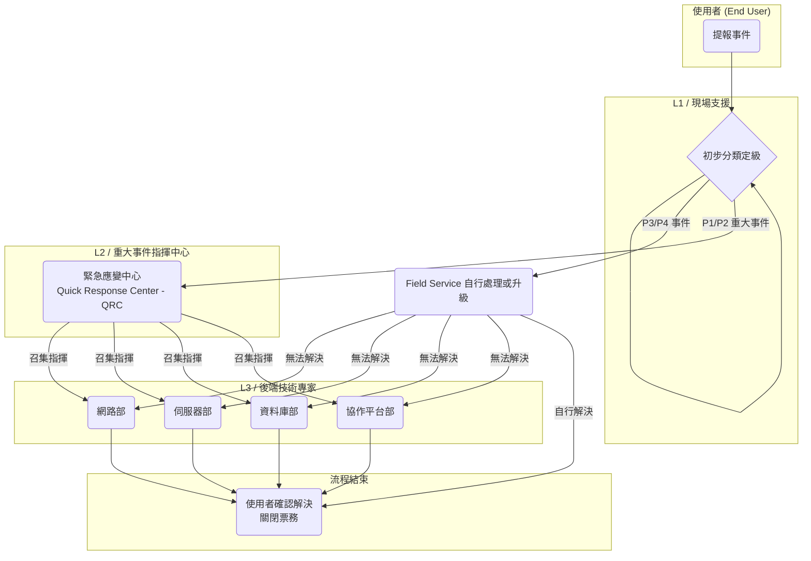

# 0728 內部流程 2.0 版

Category: 會議紀錄
Assign: Vincent Hsu

### **2.0 [公司名稱] IT 系統事件票務管理流程 (Incident Ticket Management Process)**

### **1. 目的 (Purpose)**

為建立一套標準化、高效率的 IT 事件回報與處理機制，確保所有 IT 相關事件能被即時記錄、分類、分派、處理及追蹤，從而縮短系統停機時間、降低對公司營運（尤其是產線）的衝擊，並提升 IT 服務品質與使用者滿意度。

### **2. 適用範圍 (Scope)**

本流程適用於公司所有員工，涵蓋所有由 IT 部門維運的資訊系統、軟體、硬體及網路服務。

### **3. 名詞定義 (Definitions)**

- **事件 (Incident):** 任何未預期的 IT 服務中斷或服務品質下降。
- **重大事件 (Major Incident):** 指被定義為 **P1** 或 **P2** 等級的事件，需要緊急應變中心 (QRC) 介入協調。
- **服務等級協議 (SLA):** IT 部門對事件處理的服務水平承諾，包含「回應時間」與「解決時間」。
- **回應時間 (Response Time):** 從使用者提單開始，到 IT 人員接手並開始處理該事件的時間。
- **解決時間 (Resolution Time):** 從事件發生開始，到找到根本原因並恢復服務的時間。

### **4. 權責單位 (Responsible Teams)**

- **緊急應變中心 (Quick Response Center - QRC):**
    - 由 **Sophia Miller** 總監領導。
    - **核心職責：** 擔任所有 **P1/P2 重大事件**的總指揮官。不直接執行修復，但負責 24/7 監控、召集並協調各技術團隊、管理事件通報，並主導事後的根本原因分析 (RCA)。
- **全球終端服務部 (Global Field Service):**
    - 由 **Carlos Rossi** 總監領導。
    - **核心職責：** 擔任 IT 的**單一入口 (Single Point of Contact)**。負責接收**所有**使用者的票務，作為 L1 支援。直接處理所有 P3/P4 事件，並在需要時提供現場支援 (On-site Support)。當鑑別出 P1/P2 事件時，**立即上報至 QRC**。
- **後端技術團隊 (Back-end Technical Teams):**
    - **網路部 (Wei Li 總監):** 作為 L3 支援，處理由 Field Service 或 QRC 升級的網路相關事件。
    - **伺服器部 (Alex Johnson 總監):** 作為 L3 支援，處理伺服器、虛擬化、儲存與作業系統相關事件。
    - **資料庫部 (Priya Sharma 總監):** 作為 L3 支援，處理核心系統資料庫的效能、可用性與資料問題。
    - **協作平台部 (Ben Carter 總監):** 作為 L3 支援，處理 M365 平台的後端架構與複雜功能問題。

---

### **5. 事件優先級與服務等級協議 (SLA)**

所有事件由 **全球終端服務部** 進行初步定級。若定級為 P1/P2，**緊急應變中心 (QRC)** 將立即接手指揮。

| 優先級 | 定義與衝擊範圍 | 對應系統/功能範例 | 主要負責單位 (Primary Responsible Unit) | 回應時間 (SLA Response) | 解決時間目標 (SLA Resolution) |
| --- | --- | --- | --- | --- | --- |
| **P1(Critical)** | **重大事件：**造成產線停工、公司核心營運全面中斷。 | • **產線控制系統 (MES/SCADA) 全面停擺**• 企業資源規劃 (ERP) 系統全公司無法使用 | **QRC (指揮) + 各技術團隊 (執行)** | **< 15 分鐘** | **< 4 小時** |
| **P2(High)** | **高衝擊事件：**造成單一部門或多個部門核心業務流程中斷。 | • **單一產線站點的系統故障**• 財會部門的 ERP 模組無法使用• 全公司的 Email 系統收發異常 | **QRC (監控) + 各技術團隊 (主導)** | **< 1 小時** | **< 8 個工作小時** |
| **P3(Medium)** | **一般事件：**影響單一或少數使用者的工作。 | • **個人 Email 客戶端問題**• Office 軟體功能異常• 無法連接部門印表機 | **全球終端服務部 (Field Service)** | **< 4 個工作小時** | **< 3 個工作日** |
| **P4(Low)** | **低衝擊事件：**對使用者造成輕微不便。 | • "How-to" 類型的操作詢問• 系統介面顯示錯誤但不影響功能 | **全球終端服務部 (Field Service)** | **< 8 個工作小時** | **< 5 個工作日** |

---

### **6. 事件處理流程 (Incident Management Workflow)**

1. **事件提報 (Ticket Creation):**
    - 使用者透過 IT 服務入口網站、Email 或緊急專線提報事件。所有提報管道統一彙整至票務系統。
2. **事件受理與分級 (Reception & Triage):**
    - **全球終端服務部 (Field Service)** 的區域團隊（如 John Lin 領導的 APAC 團隊）接收所有新進票務。
    - 服務人員於 **15 分鐘內**聯繫使用者或檢視內容，並根據 SLA 表設定 **優先級 (P1-P4)**。
3. **事件分派與處理 (Assignment & Resolution):**
    - **對於 P3/P4 事件:**
        - 由 **Field Service** 團隊直接處理。
        - 若需後端支援（如 M365 帳號後台問題），Field Service 可將票務升級至對應的 L3 技術團隊（如**協作平台部**）。
        - L3 團隊處理完畢後，將票務指回 Field Service 進行使用者確認。
    - **對於 P1/P2 重大事件:**
        - **Field Service** 人員鑑別出事件後，**必須立即**透過緊急通報機制，將事件**上報至緊急應變中心 (QRC)**。
        - **QRC** 的值班指揮官 (如 Ken Watanabe) 接手事件，成為**事件總指揮官 (Incident Commander)**。
        - QRC 負責開啟作戰會議室 (War Room Conference Call)，並立即召集所需的技術團隊（如**伺服器部**的 Leo Martinez、**資料庫部**的 Carlos Gomez 等）加入處理。
        - 各技術團隊在 QRC 的協調下進行故障排除，並隨時回報進度。Field Service 則轉為負責對終端使用者進行溝通與安撫。
4. **事件解決與關閉 (Resolution & Closure):**
    - 問題解決後，負責的 IT 人員需在票務中詳實記錄解決方案。
    - **Field Service** 聯繫提單使用者，確認服務已恢復正常。
    - 使用者確認後，由 **Field Service** 將票務狀態設為「已解決」，系統將在 3 個工作日後自動關閉。

### **7. 流程圖 (Workflow Diagram)**

